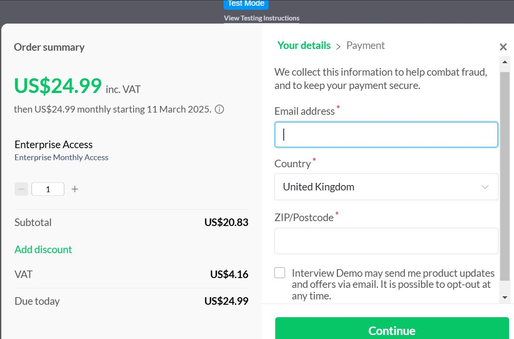
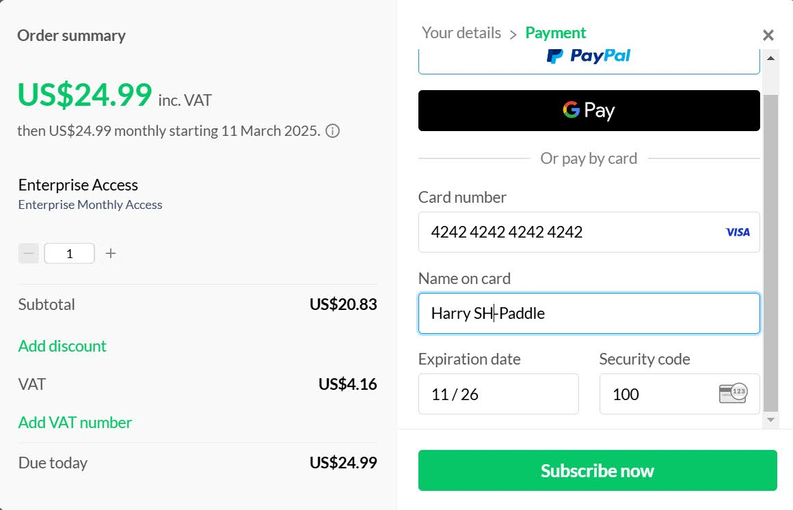
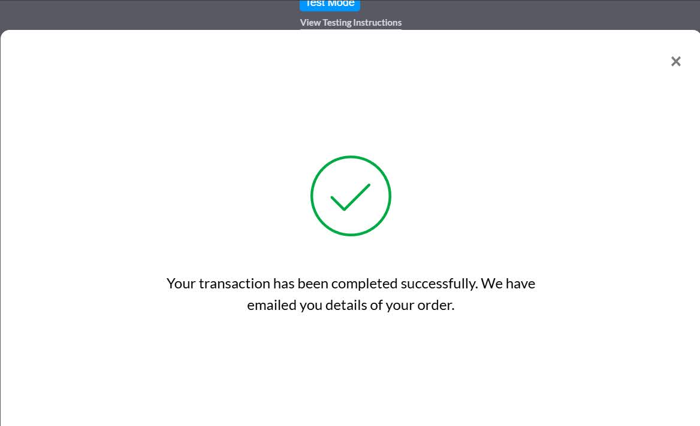

# Paddle Checkout Integration

A simple implementation of Paddle's checkout system using their v2 JavaScript library. This project consists of a frontend HTML page for the checkout interface and a Node.js backend server to securely handle the Paddle client token.

## Prerequisites

- Node.js and npm installed
- A Paddle account with API credentials
- Basic knowledge of HTML and JavaScript

## Setup

1. Clone the repository:

```bash
git clone [your-repo-url]
cd [your-repo-name]
```

2. Install dependencies:

```bash
npm install
```

3. Create a `.env` file in the root directory and add your Paddle client token:

```bash
PADDLE_CLIENT_TOKEN=your_paddle_client_token_here
```

## Project Structure

- `paddle.html` - Frontend checkout page
- `server.js` - Backend server for secure token handling

## Running the Project

1. Start the backend server:

```bash
node server.js
```

2. Open `paddle.html` in your browser

The server will run on `http://localhost:5000`

## Features

- Secure handling of Paddle client token through backend
- Sandbox mode for testing
- Simple checkout button implementation
- CORS enabled for local development
- Built-in VAT handling
- Multiple payment methods (PayPal, Google Pay, Credit Card)

## Checkout Flow

Here's what your customers will experience:

1. **Customer Details Entry**  
     
   Customers enter their contact information and location for VAT calculations.

2. **Payment Method Selection**  
     
   Multiple payment options including PayPal, Google Pay, and credit card.

3. **Order Confirmation**  
     
   Successful transaction confirmation with email notification.

## Usage

1. The frontend loads the Paddle.js library and initialises it with your client token
2. Click the checkout button to open Paddle's checkout modal
3. Complete the purchase flow in the modal

## Configuration

- The project uses Paddle's sandbox environment by default
- To switch to production, remove or modify the `Paddle.Environment.set("sandbox")` line
- Update the `priceId` in the checkout button to match your product

## Security Notes

- Never expose your Paddle client token directly in frontend code
- Always serve the token through a secure backend
- Use environment variables for sensitive data
